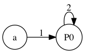

# Reducer

A simple tool developed in Haskell to reduce a sequence of elements,
represented by strings, to a simple expression by finding repeating patterns.

For a live demo visit: http://reducer.nrc.pt.

## Example

### Using ghci

Using ghci, to reduce the sequence ["a","a","b","c","a","b","c"]:

    *Reducer> let (expr,patterns) = reduce ["a","a","b","c","a","b","c"]

The final reduced expression is:

    *Reducer> expr
    ["a","P0","P0"]

And the patterns found are:

    *Reducer> patterns
    [("P0",["a","b","c"])]

### Using the command line

You can use the main.hs program to build a GraphViz representation of the reduced
expression. The input expression shoud be stored in a JSON file:

    $ cat ex/input.json 
    ["a","a","b","c","a","b","c"]

run the program using for example runhaskell, giving as argument the input file,
and saving the output to a new file:

    $ runhaskell main.hs ex/input.json > ex/expr.dot

Now use the dot tool from GrpahViz to create a png file for example:

    $ dot -Tpng ex/expr.dot > ex/expr.png

You should see something similar to the image below:

## About

Developed by: Almeida, J.J, Oliveira, J.N., and Carvalho, N.R.

